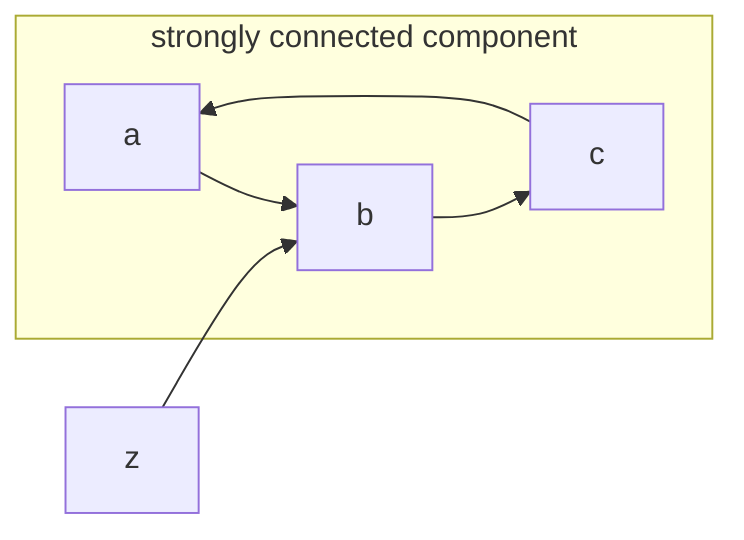

# implementation of tarjan's algorithm for finding strongly connected components in graphs

A [strongly connected component](https://en.wikipedia.org/wiki/Strongly_connected_component) in a graph -- which I may call a cycle in this repo -- is subgraph in which we can find a path that starts and ends in the same node, as you may see illustrated in the example below

the algorithm aims to identify these cycles, and returns a vector with pointers representing each cycle. In the example above, the program would return `{&a, &b, &c}`.

## todo:
1. benchmark
2. write a brief explanation of the algorithm itself based on the comments in [the implementation code](src/tarjan.cc)
